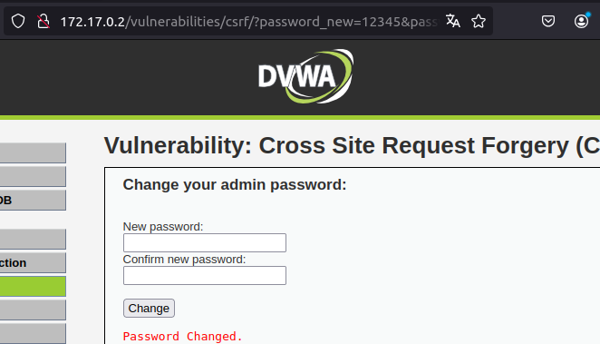
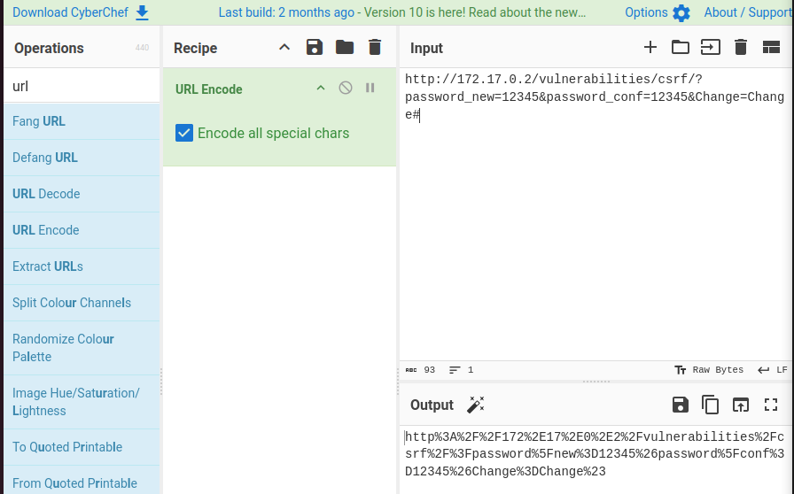
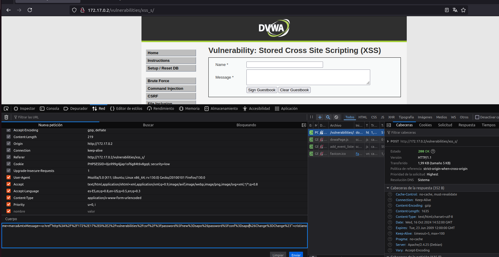

1. ponemos la contraseña que queramos en csrf y pillamos la url
http://172.17.0.2/vulnerabilities/csrf/?password_new=12345&password_conf=12345&Change=Change#

encodeamos con ciberchef con el url encode

luego vamos a xss stored

escribimos un articulo y le damos a sign guestbook luego en inspeccionar nos vamos a red pillamos el post, le damos a editar y enviar
aqui le cambiamos la contraseña

y yasta