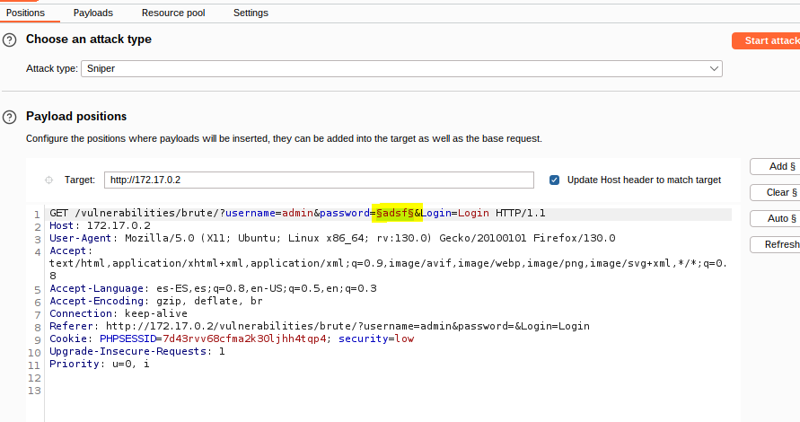

pillo la solicitud y la mando a intruder

intercepto la peticion y selecciono la contraseña y le doy a add

aqui le meto en payload el diccionario de rockyou.txt para probar las contraseñas

aqui vemo como da correcto en todos pero no es verdad lo que nos tenemos que fijar en length y vemo que password es la unica diferente

y aqui comprobamos como me ha dejado entrar 

