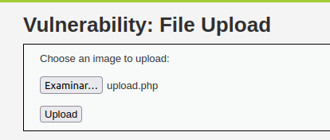
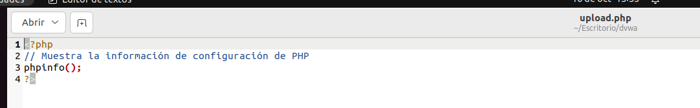
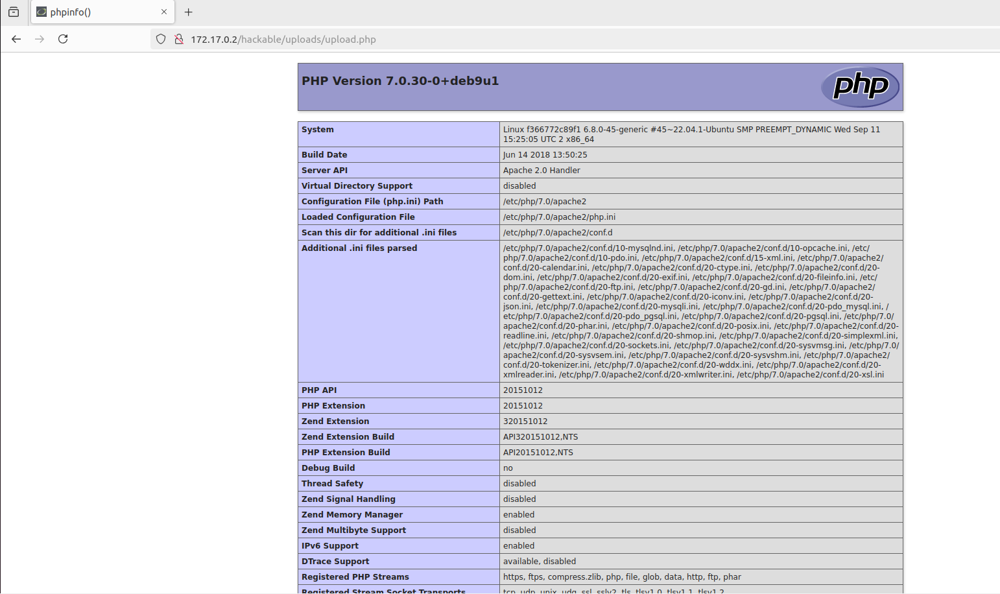
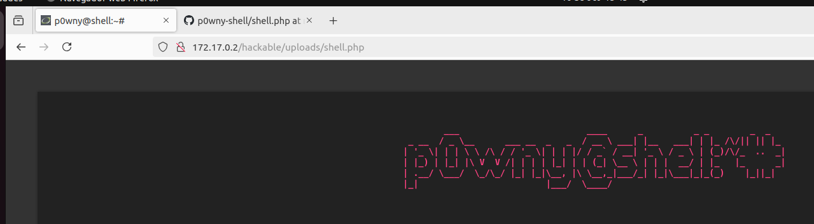

subimos el archivo que tiene este contenido

ya hemos accedido a la ruta donde se almacena el archivo poniendo la ruta

aqui he conseguido meterle una shell

cuando queramos usar la reverse shell 
abrimos el puerto primero y despues editamos el archivo y ponemos el puerto que hemos abierto y nuestra ip