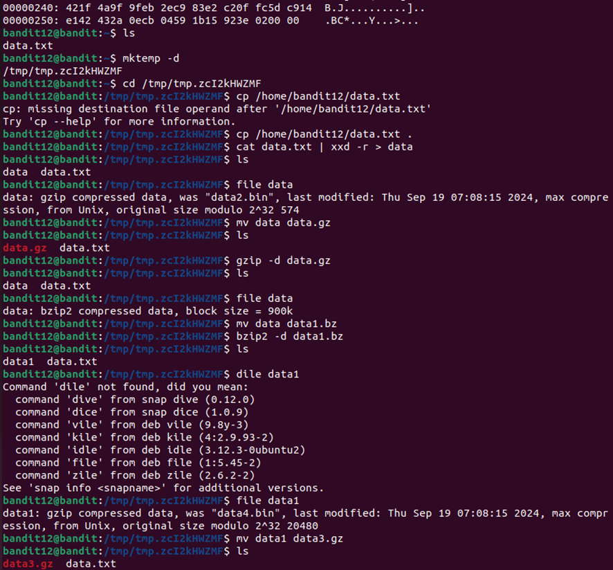
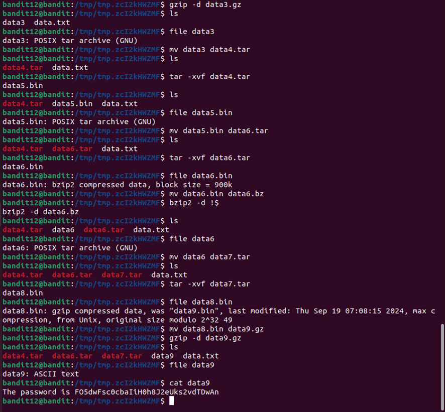
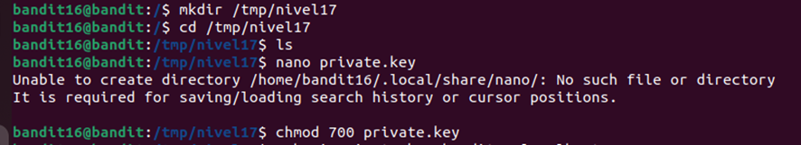
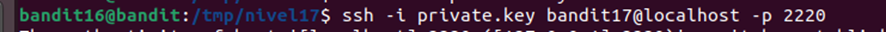

# Nivel 0
El objetivo de este nivel es que inicies sesión en el juego mediante SSH. El host al que debes conectarte es bandit.labs.overthewire.org , en el puerto 2220. El nombre de usuario es bandit0 y la contraseña es bandit0 . Una vez que hayas iniciado sesión, ve a la página del Nivel 1 para descubrir cómo superar el Nivel 1.

sudo ssh bandit0@bandit.labs.overthewire.org -p 2220

# Nivel 0-1
La contraseña para el siguiente nivel se almacena en un archivo llamado readme ubicado en el directorio de inicio. Usa esta contraseña para iniciar sesión en bandit1 mediante SSH. Siempre que encuentres una contraseña para un nivel, usa SSH (en el puerto 2220) para iniciar sesión en ese nivel y continuar el juego.

ls
cat readme

# Nivel 1-2
La contraseña para el siguiente nivel se almacena en un archivo llamado - ubicado en el directorio de inicio

cat ./-

Aquí nos pide que busquemos la contraseña del siguiente nivel en un archivo llamado – y como en linux esto lo interpreta que es el inicio de una opcion de comando lo escapamos con ./

# Nivel 2-3
La contraseña para el siguiente nivel se almacena en un archivo llamado espacios en este nombre de archivo ubicado en el directorio de inicio

cat spaces\ in\ this\ filename

Tambien lo podriamos hacer cat “spaces in this filename”

# Nivel 3-4
La contraseña para el siguiente nivel se almacena en un archivo oculto en el directorio inhere .

cd inhere/
ls -la
cat ...Hiding-From-You

# Nivel 4-5
La contraseña para el siguiente nivel se almacena en el único archivo legible por humanos en el directorio inhere . Consejo: si tu terminal está en problemas, prueba el comando “reset”.

file ./* | grep text
cat ./-file07

usando text podemos ver que archivos son legibles para humanos

# Nivel 5-6
La contraseña para el siguiente nivel se almacena en un archivo en algún lugar del directorio inhere y tiene todas las siguientes propiedades:

-legible por humanos
-1033 bytes de tamaño
-no ejecutable

find . -type f -size 1033c ! -perm /111

find . busca en el directorio actual (.) y sus subdirectorios.
-type f busca solo archivos regulares.
-size 1033c busca archivos que tienen un tamaño exacto de 1033 bytes.
! -perm /111 excluye los archivos que tienen permisos de ejecución para el propietario, el grupo o los demás.

# Nivel 6-7
La contraseña para el siguiente nivel se almacena en algún lugar del servidor y tiene todas las siguientes propiedades:

-propiedad del usuario bandit7
-propiedad del grupo bandit6
-33 bytes de tamaño

find / -user bandit7 -group bandit6 -size 33c 2>/dev/null

/ busca en todo el sistema.
-user bandit7 busca archivos propiedad del usuario bandit7.
-group bandit6 busca archivos propiedad del grupo bandit6.
-size 33c busca archivos con un tamaño exacto de 33 bytes.
2>/dev/null oculta los mensajes de error por falta de permisos

# Nivel 7-8
La contraseña para el siguiente nivel se almacena en el archivo data.txt junto a la palabra millonésima.

grep "millionth" data.txt

con grep podemos filtrar texto dentro de un archivo

# Nivel 8-9
La contraseña para el siguiente nivel se almacena en el archivo data.txt y es la única línea de texto que aparece solo una vez.

sort data.txt | uniq -u

con sort ordenamos el archivo y el uniq -u sirve para detectar la linea de texto que solo aparece una vez

# Nivel 9-10
La contraseña para el siguiente nivel se almacena en el archivo data.txt en una de las pocas cadenas legibles por humanos, precedida por varios caracteres '='.

strings data.txt | grep "="

strings data.txt extrae las secuencias de texto legibles de un archivo binario o de texto (data.txt).
| grep "=" filtra esas líneas, mostrando solo las que contienen el signo "=".

# Nivel 10-11
La contraseña para el siguiente nivel se almacena en el archivo data.txt , que contiene datos codificados en base64.

base64 --decode data.txt

Aquí lo que he hecho es usar base64 –decode para descodificar el texto y poder tenerlo en texto normal

# Nivel 11-12
La contraseña para el siguiente nivel se almacena en el archivo data.txt , donde todas las letras minúsculas (az) y mayúsculas (AZ) se han rotado 13 posiciones.

echo "Gur cnffjbeq vf 7k16JArUVv5LxVuJfsSVdbbaHGlw9D4" | tr 'A-Za-z' 'N-ZA-Mn-za-m'

A-Za-z: corresponde al alfabeto normal (mayúsculas y minúsculas).
N-ZA-Mn-za-m: corresponde al alfabeto rotado 13 posiciones.
Y el tr es para desrotar y usamos el echo para que imprima lo que le metamos

# Nivel 12-13
La contraseña para el siguiente nivel se almacena en el archivo data.txt , que es un volcado hexadecimal de un archivo que ha sido comprimido repetidamente. Para este nivel puede ser útil crear un directorio en /tmp en el que pueda trabajar. Utilice mkdir con un nombre de directorio difícil de adivinar. O mejor, utilice el comando “mktemp -d”. Luego copie el archivo de datos utilizando cp y renómbrelo utilizando mv (¡lea las páginas del manual!).

He seguido los pasos de un video

FO5dwFsc0cbaIiH0h8J2eUks2vdTDwAn

# Nivel 13-14
La contraseña para el siguiente nivel se almacena en /etc/bandit_pass/bandit14 y solo la puede leer el usuario bandit14 . Para este nivel, no obtienes la siguiente contraseña, pero sí una clave SSH privada que se puede usar para iniciar sesión en el siguiente nivel. Nota: localhost es un nombre de host que hace referencia a la máquina en la que estás trabajando

ssh -i sshkey.private bandit14@localhost -p 2220
cat /etc/bandit_pass/bandit14

MU4VWeTyJk8ROof1qqmcBPaLh7lDCPvS

Aquí lo que hemos hecho es iniciar sesion en el nivel 14 con la clave ssh que teniamos en el 13 y nos ha mostrado la contraseña pero tampoco nos hace falta porque ya hemos iniciado por clave ssh

# Nivel 14-15
La contraseña para el siguiente nivel se puede recuperar enviando la contraseña del nivel actual al puerto 30000 en localhost 

telnet localhost 30000

8xCjnmgoKbGLhHFAZlGE5Tmu4M2tKJQo

Con telnet nos conectamos a nuestra maquina que en vd seria la maquina del bandit porque nosotros estamos conectado a ellos por ssh que seria localhost y salfriamos por el puerto 30000 y ahí al meter la contraseña del nivel anterior nos devuelve la del nivel 15

# Nivel 15-16
La contraseña para el siguiente nivel se puede recuperar enviando la contraseña del nivel actual al puerto 30001 en el host local usando encriptación SSL/TLS.
Nota útil: ¿Está obteniendo “TERMINADO”, “RENEGOCIANDO” o “ACTUALIZANDO KEYUPDATE”? Lea la sección “COMANDOS CONECTADOS” en la página del manual.

Aquí estamos utlizando en protocolo ssl del cliente y nos vamos a conectar a nuestra misma maquina por el puerto 30001 y cuando enviamos la  contraseña del nivel anterior nos devolvera la del n

openssl s_client -connect localhost:30001

kSkvUpMQ7lBYyCM4GBPvCvT1BfWRy0Dx

# Nivel 16-17
Las credenciales para el siguiente nivel se pueden recuperar enviando la contraseña del nivel actual a un puerto en el host local en el rango 31000 a 32000. Primero, averigüe cuáles de estos puertos tienen un servidor escuchando. Luego, averigüe cuáles de ellos usan SSL/TLS y cuáles no. Solo hay un servidor que proporcionará las siguientes credenciales, los demás simplemente le enviarán de vuelta lo que usted les envíe.
Nota útil: ¿Está obteniendo “TERMINADO”, “RENEGOCIANDO” o “ACTUALIZANDO KEYUPDATE”? Lea la sección “COMANDOS CONECTADOS” en la página del manual.

Escaneamos los puertos abiertos entre el 31000 y el 32000
nmap -p 31000-3200 localhost

Con ncat nos permite hacer una conexión segura mediante ssl al host local por el puerto 31790
Y cuando ingresemos la contraseña del nivel anterior nos dara una clave privada

ncat --ssl localhost 31790

Luego nos tendremos que ir a tmp porque si no nos dejara crear ningun archivo 
Y aquí creamos el archivo con la clave privada que nos ha dado y le damos permisos de ejecucion al archivo

Y ya nos conectamos al nivel 17 con la clave privada 

# Nivel 17-18
Hay 2 archivos en el directorio de inicio: passwords.old y passwords.new . La contraseña para el siguiente nivel está en passwords.new y es la única línea que se ha cambiado entre passwords.old y passwords.new.

NOTA: si has resuelto este nivel y ves "¡Adiós!" al intentar iniciar sesión en bandit18, esto está relacionado con el siguiente nivel, bandit19

diff password.old password.new
x2gLTTjFwMOhQ8oWNbMN362QkxfRqGlO

# Nivel 18-19
La contraseña para el siguiente nivel se almacena en un archivo readme en el directorio de inicio. Lamentablemente, alguien ha modificado .bashrc para cerrar la sesión cuando inicia sesión con SSH

Con cat ~/readme entre comillas lo que hacemos es inyectar ese codigo ya que hay algo que no nos deja iniciar normalmente en el nivel y entonces no podemos verlo de manera normal

sudo ssh bandit18@bandit.labs.overthewire.org -p 2220 "cat ~/readme"

# Nivel 19-20
Para acceder al siguiente nivel, debe utilizar el binario setuid en el directorio de inicio. Ejecútelo sin argumentos para saber cómo usarlo. La contraseña para este nivel se puede encontrar en el lugar habitual (/etc/bandit_pass), después de haber utilizado el binario setuid.

Aquí no nos deja ver lo que tiene dentro por que el archivo tiene el uid de bandit 20 y noostros somos bandit 19 asi que lo que voy a hacere es ejecutarlo como bandit 20

ls
./bandit20-do id
./bandit20-do cat /etc/bandit_pass/bandit20

0qXahG8ZjOVMN9Ghs7iOWsCfZyXOUbYO

# Nivel 20-21