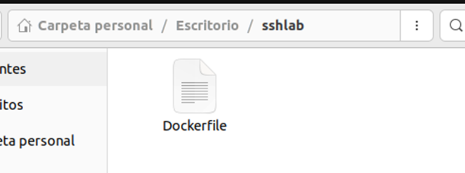
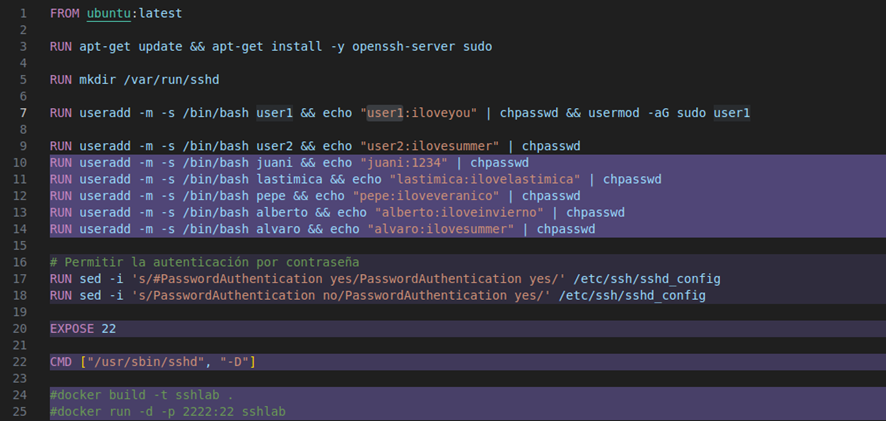
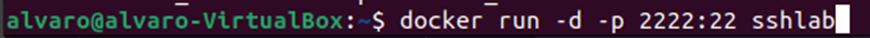
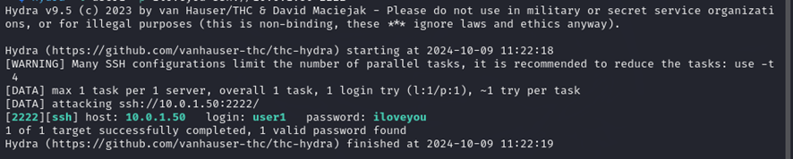
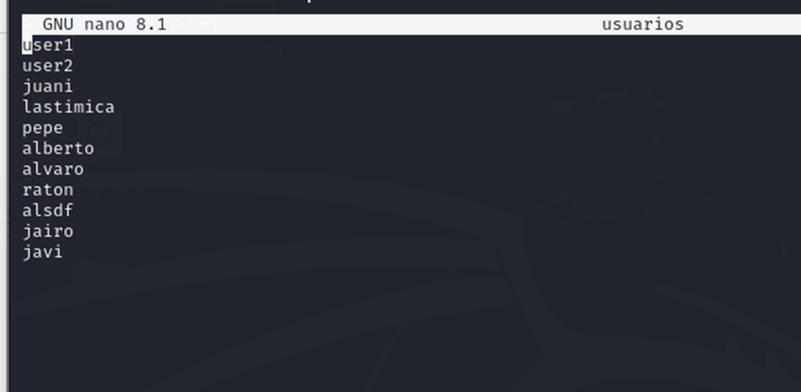
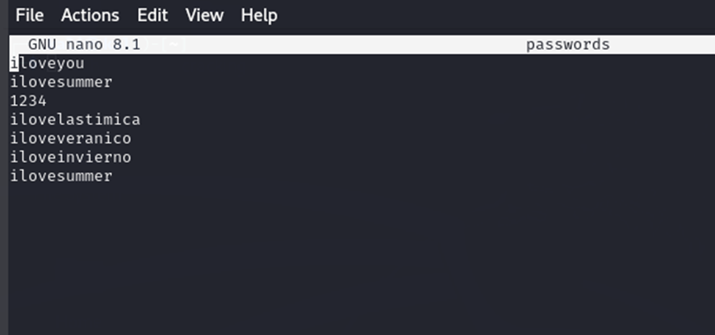
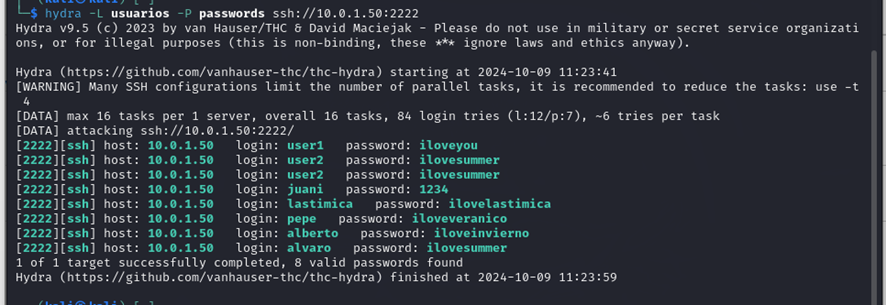

# Como crear una imagen docker 
Primero vamos a poner este codigo

Primero construimos esta imagen con

Y despues lo arrancamos	

Y despues lo arrancamos	

Y nos conectamos

Y ya estariamos conectados

# Ahora vamos a explicar lo que hemos hecho con hydra
Con este comando comprobanos sencillamente si coincide el usuario con la contraseña

Luego lo podemos hacer con un diccionario de usuario y otro de contraseñas y podemos comprobar a lo bruto que coincidencias tenemos

Y aquí nos muestra las coincidencias que ha habido
