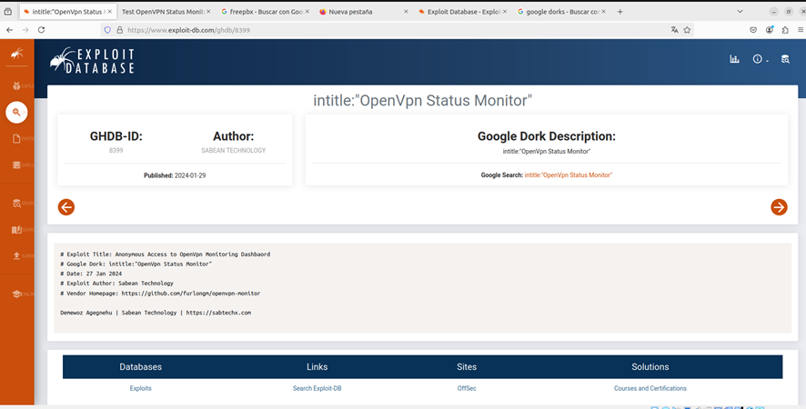
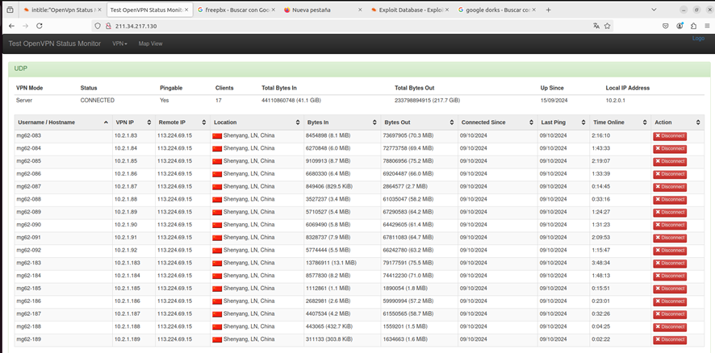
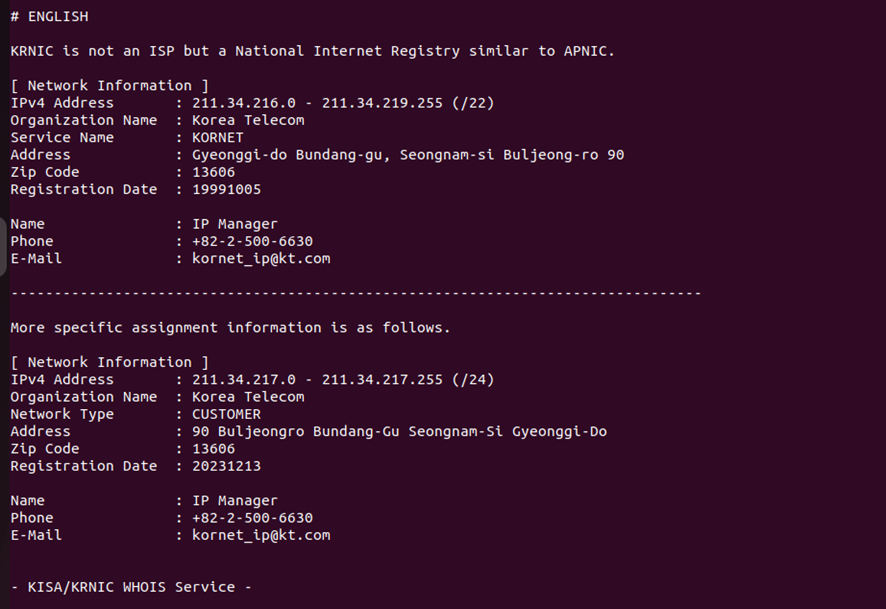
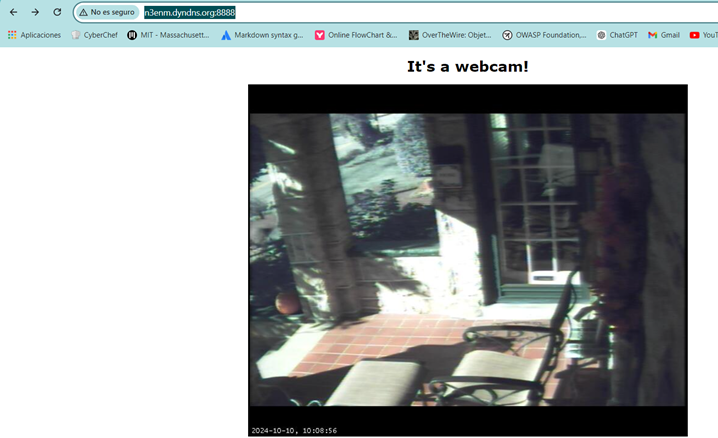
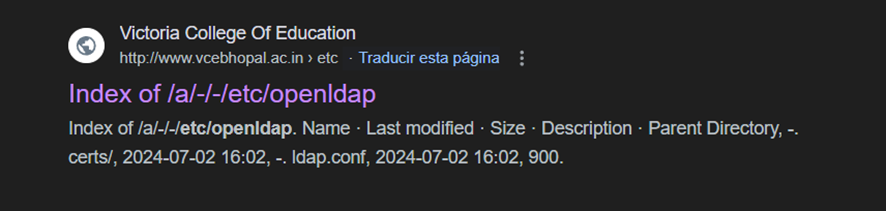
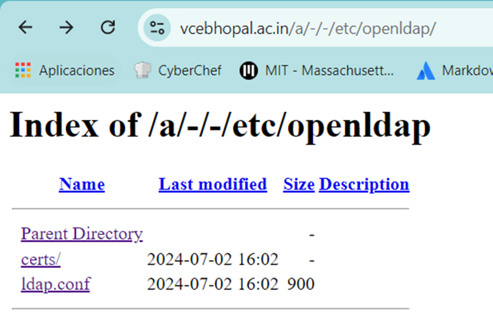
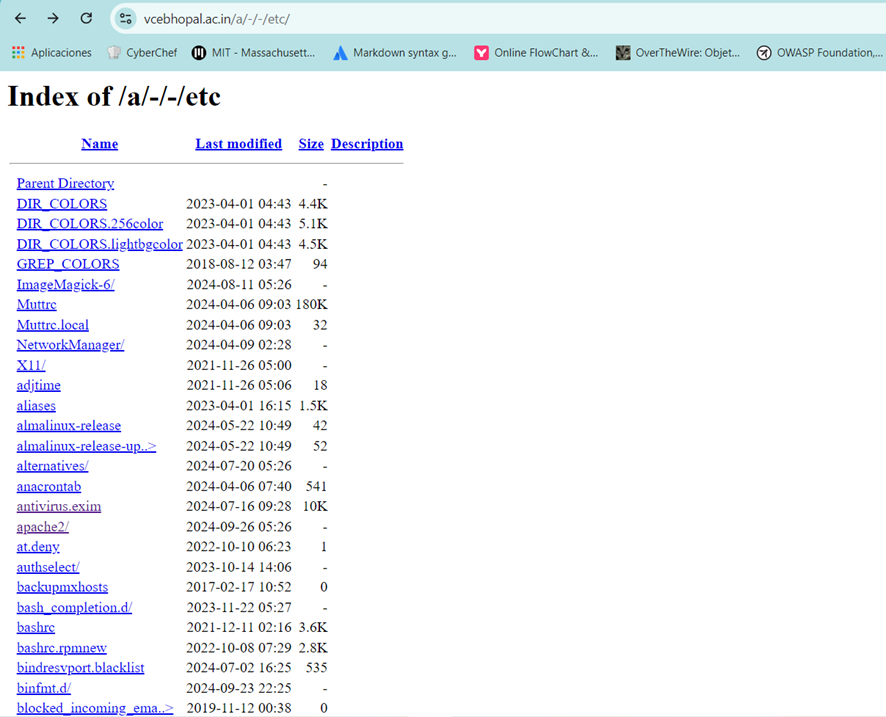

# Dorks
# 1 Aquí estamos entrando en un gestor de openvpn que dentro se puede ver a los usuarios que hay conectados y tambien puedes desconectarnos

## EXPLICACION DE PORQUE HE PODIDO ENTRAR
Mala configuración de permisos: Si los administradores del servidor no han configurado correctamente las restricciones de acceso, la página puede ser visible para cualquiera
Falta de autenticación: Algunas implementaciones de OpenVPN o de otros servicios de gestión no establecen protección mediante contraseña o usan credenciales inseguras.
Uso de protocolos inseguros: En la imagen que has proporcionado, se nota que el sitio no está utilizando HTTPS, lo que significa que las conexiones no están cifradas

# 2 Aquí estamos entrando en una camara ip que controla las entradas a la casa
http://n3enm.dyndns.org:8888/

## EXPLICACION DE PORQUE HEMOS PODIDO ENTRAR
Sin contraseña o credenciales por defecto: Muchas cámaras IP se venden con credenciales por defecto (como "admin/admin"), y si el propietario no cambia esas credenciales, es posible acceder fácilmente a través de Google Dorks o herramientas de escaneo.
Cámara expuesta a Internet sin medidas de seguridad: A menudo, las cámaras IP están expuestas directamente en Internet sin configuraciones de seguridad adicionales, como firewalls o VPNs
Malas prácticas de configuración: Los administradores o dueños de la cámara no han configurado correctamente los permisos de acceso ni las restricciones necesarias para evitar que cualquier usuario pueda acceder sin autenticación.
	

# 3 Aquí hemos entrado a un servidor ldap

## Explicacion de porque hemos podido entrar
LDAP anónimo habilitado: Algunos servidores LDAP permiten consultas anónimas (sin autenticación). Aunque esto no da acceso completo, a veces puede permitir la visualización de información básica de la estructura de directorios.
Configuración incorrecta: El servidor LDAP puede estar mal configurado y expuesto directamente a Internet sin estar restringido a una red interna
No uso de LDAP seguro (LDAPS): Si el servidor LDAP no está utilizando un protocolo seguro como LDAPS (LDAP sobre SSL/TLS), es posible que se pueda acceder a él utilizando un cliente LDAP sin ningún tipo de protección de cifrado

4