# Google gruyere 
1.	Vamos a registrarnos en google gruyere  
-lo primero que vemos es que esta en claro nuestro usuario y contraseña lo que es una gran vulnerabilidad
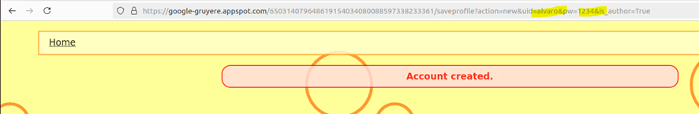

Ahora vamos a subir este archivo a la pagina y si fuese una pagina normal, no dejaria que se pudiese ejecutar el codigo de nuestro script, solo lo almacenaria pero en este caso, si va a dejar ejecutarlo 

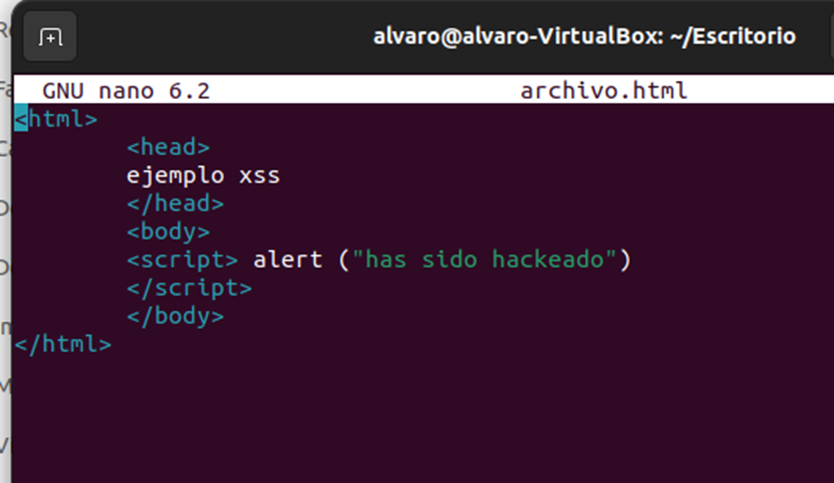

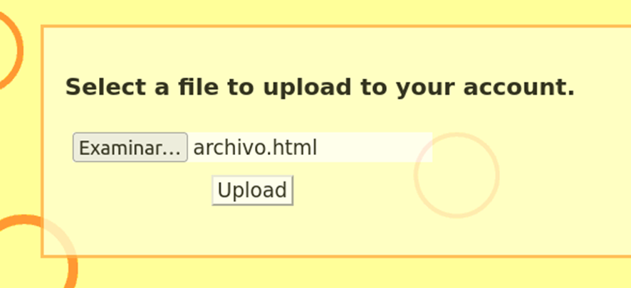

Copiamos la direccion donde pone que se ha almacenado nuestro archivo

Y como podemos ver se esta ejecutando el codigo en la pagina

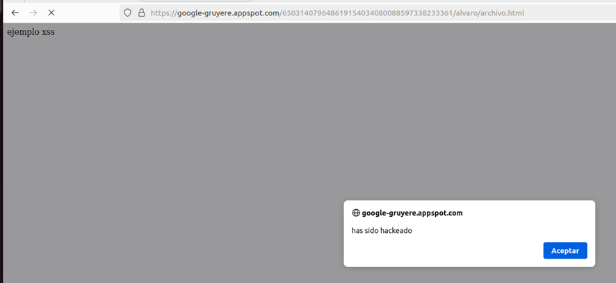

Ahora vamos a inyectar en el snippet un script que cuando pasemos el raton por encima del texto se ejecute y nos salga una ventana emergente

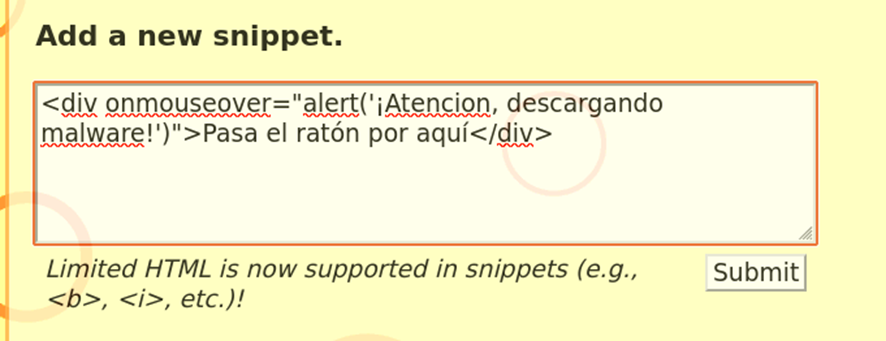

Y aquí podemos ver como sale la pestaña emergente

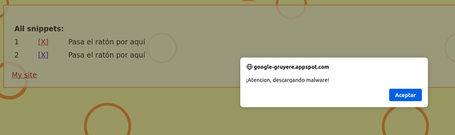

Si ponemos esta direccion en el buscador nos cargamos la pagina entera

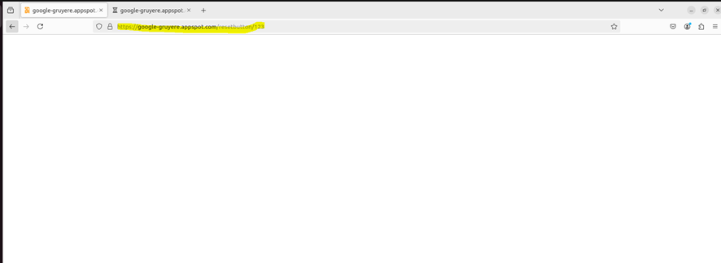

Para sacar la cookie

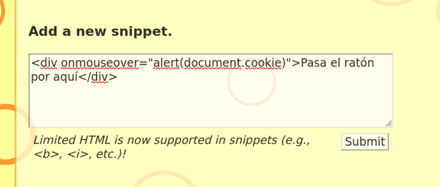

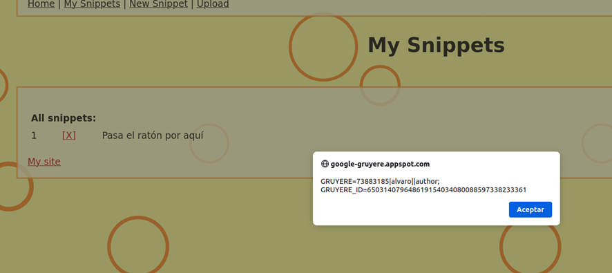

Ahora lo que vamos a hacer es que cuando pase el raton por encima del texto es que mande mi cookie del usuario al backend (a mi servidor)  

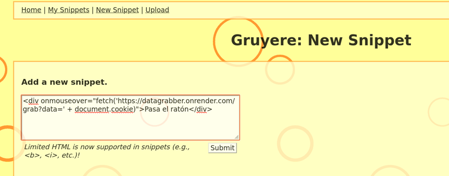

Aquí podemos comrpbar ocmo ha llegado la cookie
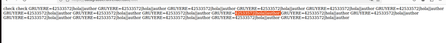

Ahora lo que he hecho es iniciar sesion con otro susuario llamado pepe

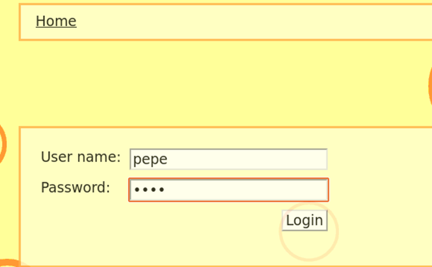

Y desde pepe abro la terminal me voy a almacenamiento y me meto en la cookie y la modifico

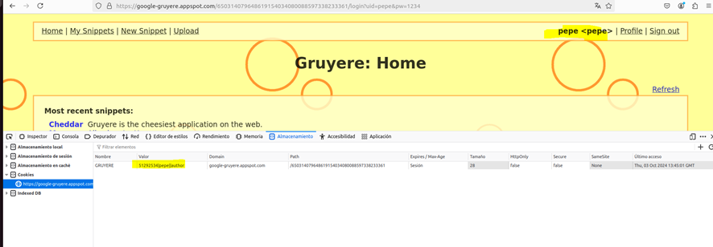

Ahora lo que voy a hacer es modificar la cookie de ppe y meto la de hola QUE ES LA QUE HE ENVIADO AL SERVIDOR

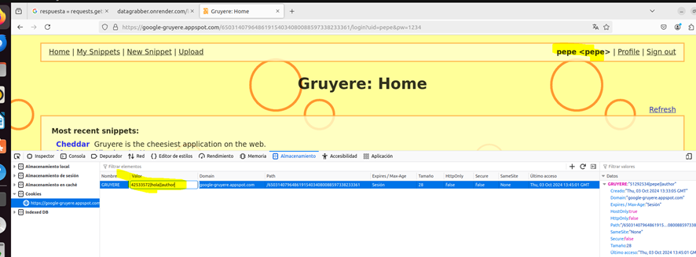

Y CUANDO LE DOY A ENTER
YA ME SALE QUE SOY HOLA

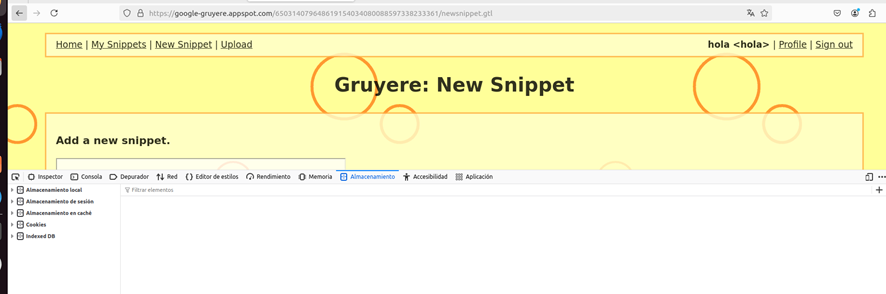